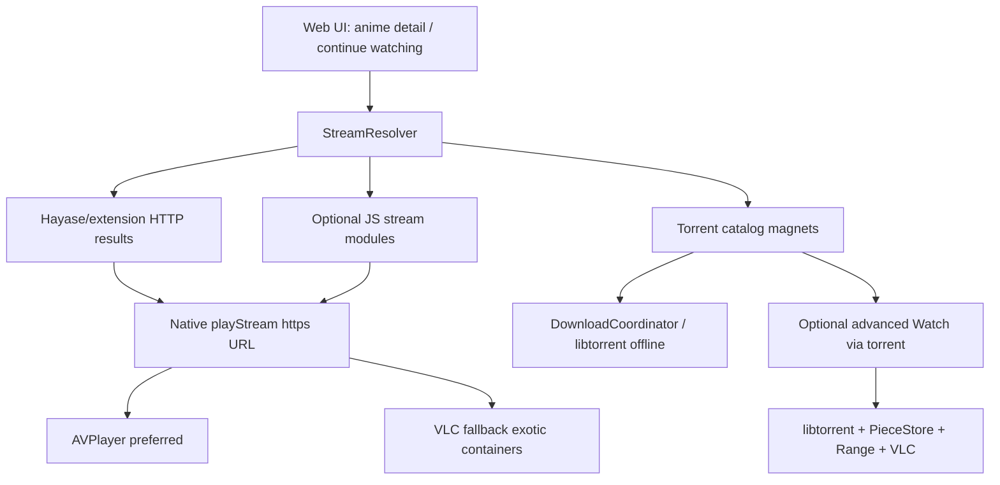

# Saizen Streaming Architecture Pivot — Validation Plan

> **SUPERSEDED (2026-08-11).** Decision locked to **full native SwiftUI rewrite + multi-module HTTP/HLS → AVPlayer** (Option C, stronger than the Option B recommendation below).  
> **Current source of truth:** [`docs/saizen-native-rewrite-plan.md`](../../saizen-native-rewrite-plan.md)  
> **v1 feature freeze:** [`docs/reference/FEATURES_SNAPSHOT_v1.3.3.md`](../../reference/FEATURES_SNAPSHOT_v1.3.3.md)  
> This file is kept for historical rationale and evidence only.

> **Purpose of this document (historical):** Hand to a reviewer (e.g. Claude) to validate whether Saizen should make a **framework / architecture-level** change to how episode streaming works, inspired by [Shirox](https://github.com/xibrox/Shirox). This is a **decision + migration plan**, not an implementation checklist for coding yet.
>
> **For agentic workers later:** After this plan is approved, use `subagent-driven-development` or `executing-plans` to implement phase-by-phase. Do **not** start coding until the validation questions at the end are answered.

**Goal:** Make “Watch episode” reliably start and sustain playback on iOS, even if that means changing Saizen’s primary streaming architecture away from magnet → libtorrent → VLC.

**Architecture (proposed):** Dual-path playback — **primary** HTTP/HLS stream resolution (module or provider → direct URL → AVPlayer), **secondary** torrent download/offline (libtorrent kept, demoted from default Watch path).

**Tech stack (current Saizen):** Next.js web UI + Capacitor 7 + Swift (`SaizenCore`) + libtorrent + MobileVLCKit + Hayase-compatible extensions.

**Reference architecture (Shirox):** Native SwiftUI + JavaScriptCore modules (`searchResults` → `extractEpisodes` → `extractStreamUrl`) → `StreamResult{url,headers,subs}` → `AVPlayer` (+ optional local HLS proxy).

---

## 0. Problem statement (evidence)

### What users experience today
- Tap Watch → magnet resolves → metadata arrives → VLC opens on loopback Range URL → frequent long buffering / stall / stop.
- Console evidence from a real session (Mushoku Tensei S3 E03, ~1.45 GB MKV):
  - `focus_head` limited wanted pieces
  - `state changed to: finished` at ~30 MB / 1.45 GB
  - peers dropped with `torrent finished`
  - VLC stuck in buffering (`state → 2`), then stopped
- Root cause class: **progressive BitTorrent of incomplete MKV** is hard on iOS (piece priority, peer churn, Range underruns). A piece-priority floor fix helps, but does not remove the class of failure.

### What Shirox does instead
- Does **not** stream torrents for Watch.
- Community JS modules scrape / resolve a **CDN HLS or MP4 URL**.
- Plays with Apple `AVPlayer` using optional HTTP headers.
- Offline = download HLS segments separately (`HLSDownloader`).

**Implication:** Shirox “feels easy” because it solved **URL extraction + CDN playback**, not P2P progressive MKV.

---

## 1. Current Saizen architecture (keep as baseline)

```
Browse / AniList-MAL (web)
  → Hayase-compatible extensions (HTTPS JS) → magnets / rare HTTP URLs
  → Capacitor bridge SaizenTorrent.playTorrent
  → libtorrent → PieceStore (sparse disk)
  → HTTPRangeServer (tokenized 127.0.0.1 Range)
  → SaizenPlayer → MobileVLCKit (MKV) / AVPlayer (MP4)
```

Canonical native code: `ios/App/SaizenCore/` (synced into Cap via `scripts/sync-swift-into-cap.sh`).

Security invariants that **must not regress** (see `.cursor/rules/saizen-security.mdc`):
- No client secrets in web env
- OAuth tokens in Keychain only
- Loopback stream URLs must be session-tokenized
- `spawnPlayer` only `https://` or `http://127.0.0.1|localhost/…`
- Extension `manifest.code` URLs must be `https://` only
- `webView.isInspectable = true` only in DEBUG

---

## 2. Options under validation

### Option A — Status quo + harden torrent streaming (smallest change)
- Keep magnet → libtorrent → VLC as default Watch.
- Continue fixing piece priorities, lookahead, reconnect, MKV cue handling.
- **Pros:** Least product change; matches current README promise.  
- **Cons:** Reliability ceiling remains low on flaky peer graphs / large MKVs; ongoing native complexity.

### Option B — Hybrid Watch (recommended for validation)
- **Default Watch path:** resolve direct HTTP/HLS/MP4 stream → play with AVPlayer (or VLC only if container requires it).
- **Torrent path:** keep for Download / “Watch via torrent” advanced option.
- Stream resolution sources (pick one or both in validation):
  1. Prefer existing Hayase/extension results that already return HTTP URLs
  2. Add Sora/Luna/Shirox-compatible **stream modules** (`extractStreamUrl` style)
- **Pros:** Biggest UX win without throwing away torrent investment.  
- **Cons:** New module ecosystem / legal-host risk; more surface area; need clear UX for two modes.

### Option C — Full Shirox-style rewrite of playback
- Make modules + AVPlayer the only Watch path.
- Remove or quarantine live torrent streaming entirely; torrents optional later for download only — or drop.
- Possibly reduce Capacitor web player involvement for video.
- **Pros:** Clearest reliability story.  
- **Cons:** Largest rewrite; may abandon differentiating Saizen feature; higher migration cost.

### Recommendation to validate
**Option B**, phased (see §5). Validate whether B is enough before approving C.

---

## 3. Target architecture (Option B)



### New conceptual components

| Component | Responsibility | Likely home |
|-----------|----------------|-------------|
| `StreamCandidate` | Normalized playable: `url`, `headers`, `kind` (`hls`/`mp4`/`mkv`/`magnet`), `quality`, `sourceId` | `packages/shared` + web |
| `StreamResolver` | Title+episode → ranked candidates from extensions/modules | `apps/web` and/or native |
| `playStream` bridge | Native: open AVPlayer/VLC for `https` (+ headers) or loopback | `ios/App/SaizenCore` + Cap plugin |
| Stream modules (optional) | Shirox-like JS: search → episodes → `extractStreamUrl` | New module store, HTTPS only |
| Existing torrent stack | Demoted to Download + optional Watch | Keep `LibtorrentEngine` |

### Explicit non-goals for Phase 1
- Not rewriting the whole app to native SwiftUI (keep Capacitor + Next unless validation demands it).
- Not removing AniList/MAL auth or Keychain token model.
- Not shipping client secrets or relaxing HTTPS-only extension/module loads.
- Not copying Shirox code verbatim (license: PolyForm Noncommercial — treat as **architecture reference only**).

---

## 4. Framework-level decisions Claude must validate

Answer each with **Approve / Modify / Reject** and a short reason.

### D1. Primary Watch transport
Should default Watch stop using magnets and use direct HTTP/HLS URLs instead?

### D2. Player choice
For HLS/MP4 HTTPS streams, should Saizen prefer **AVPlayer** over MobileVLCKit? Keep VLC for MKV / torrent Range only?

### D3. Module system
Should Saizen add a **second** module/extension type (Sora/Shirox-style stream extractors), or stretch Hayase torrent extensions to also return HTTP streams?

### D4. Capacitor boundary
Is Cap bridge + web UI still correct for playback UX, or should fullscreen player become a mostly-native SwiftUI surface (Shirox-like) while web keeps browse/library?

### D5. Torrent product role
Are torrents:
- (a) Download-only,
- (b) Advanced Watch option,
- (c) Still default Watch?

### D6. Legal / ToS posture
Streaming-site modules vs torrent indexes — which risk profile is acceptable for a personal sideload app? Any hosts that must stay blocked?

### D7. Scope of rewrite
Is Option B sufficient for “streaming works properly”, or does reliability require Option C (drop live torrent Watch entirely)?

### D8. Shared package contract
Should `packages/shared` gain a first-class `StreamCandidate` / play intent schema that both web and Swift understand, before any UI work?

---

## 5. Phased migration (only after D1–D8 approved)

### Phase 0 — Decision lock (this doc)
- Validate options and decisions above.
- Freeze: Option A / B / C + answers to D1–D8.
- **Exit:** Written ADR (architecture decision record) in `docs/superpowers/specs/`.

### Phase 1 — Prefer HTTP when already available (low risk)
**Intent:** Use paths Saizen already claims to support (“HTTP progressive preferred”).

- Inventory extension/search results that already return `http(s)` episode URLs.
- Ensure Watch prefers those over magnets when present.
- Native `playStream(https, headers?)` → AVPlayer path; measure start time / rebuffer rate.
- Keep torrent path unchanged as fallback.

**Exit criteria:** At least one common show can Watch via HTTPS without libtorrent.

### Phase 2 — Stream resolver + candidate UI
- Introduce `StreamCandidate` model + ranking (codec, resolution, source reliability, type).
- Episode sheet: list candidates (HLS/MP4 first, magnet last).
- Persist last-good source per anime/episode.

**Exit criteria:** User can see why a source was chosen; can force alternate.

### Phase 3 — Optional stream modules (Shirox-like)
- Define minimal JS contract (document compatibility target; do not paste Shirox code):
  - `searchResults(query)`
  - `extractEpisodes(showUrl)`
  - `extractStreamUrl(episodeUrl)` → URL or `{streams:[{url,headers,title}], subtitle?}`
- Run in isolated JS context (web worker **or** native JSContext — decide in Phase 0).
- HTTPS-only script URLs; host allow/deny list; no eval of non-HTTPS.
- Cloudflare/cookie strategy: decide whether to port concepts or keep simpler fail+retry UX.

**Exit criteria:** Installing one external module yields playable HLS for a test title.

### Phase 4 — Demote torrent Watch
- Default button: “Watch” → best HTTP/HLS candidate.
- Secondary: “Download torrent” / “Watch via torrent”.
- Keep libtorrent piece-floor / sequential fixes for download + advanced watch.
- Update README playback diagram.

**Exit criteria:** New users never hit magnet path unless they opt in.

### Phase 5 — Hardening (only if still needed)
- Native HLS proxy for header-sensitive CDNs (Shirox `HLSProxyServer` concept).
- Stall recovery / foreground rebuild for AVPlayer.
- Offline HLS download (optional; large scope — separate plan).

---

## 6. What to keep vs change

### Keep (high confidence)
- AniList / MAL OAuth + Keychain
- Capacitor shell for browse/settings (unless D4 says otherwise)
- Hayase extension catalog for torrent/download discovery
- libtorrent + PieceStore for offline downloads
- Security preflight / IPA secret scanning
- Tokenized loopback Range server (for torrent/local paths)

### Change (if Option B/C approved)
- Default Watch resolution pipeline
- Player selection policy (AVPlayer-first for progressive HTTPS)
- UX copy and source picker
- Possibly add stream-module runtime

### Do not change without explicit approval
- Moving OAuth tokens back into `localStorage`
- Allowing non-HTTPS module/extension code URLs
- Wildcard CORS on loopback server
- Shipping provider secrets in web bundle

---

## 7. Risks and open questions

| Risk | Why it matters | Mitigation to validate |
|------|----------------|------------------------|
| Stream modules break often | Sites change HTML/APIs | Multi-module fan-out; cache last-good; clear error UX |
| Legal / ToS | Scraping streaming sites ≠ torrent indexes | Personal-use framing; host blocklist; no bundled pirate modules |
| Capacitor + AVPlayer headers | Some CDNs need Referer/UA | Native asset headers; optional local proxy |
| Dual systems complexity | Two Watch paths confuse users + maintainers | Clear default; hide torrent under Advanced |
| Shirox license | PolyForm Noncommercial — not a code donor | Architecture reference only; clean-room APIs |
| False confidence in Phase 1 | Few extensions return HTTP | May force Phase 3 sooner — validate early with real catalogs |

---

## 8. Success metrics (product)

A pivot is “done enough” when, on a physical iPhone, for 3 popular airing/recent shows:
1. Tap Watch → first frame ≤ ~10–15s on a normal network (not torrent-swarm dependent).
2. No premature “torrent finished” peer wipe on the default path.
3. Rebuffer ratio subjectively acceptable for 10+ minutes continuous play.
4. Download-via-torrent still works for at least one magnet source.
5. Security preflight still passes (`pnpm preflight` / release script).

---

## 9. Suggested prompt to give Claude (copy/paste)

```text
You are reviewing an architecture pivot for Saizen (iOS anime client:
Next.js + Capacitor + Swift + libtorrent + VLC). Read this plan fully:

docs/superpowers/plans/2026-08-11-shirox-style-streaming-architecture.md

Also skim:
- README.md (playback path)
- .cursor/rules/saizen-security.mdc
- ios/App/SaizenCore/Torrent/LibtorrentEngine.swift
- ios/App/SaizenCore/Torrent/LibtorrentBridge.cpp (focus_head / prioritize_bytes)
- apps/web extension/search play entrypoints

Context: Shirox streams via JS modules → HTTPS HLS/MP4 → AVPlayer.
Saizen streams via magnets → libtorrent → Range HTTP → VLC and stalls.

Tasks for you:
1. Challenge Option A vs B vs C. Pick one and justify.
2. Answer decisions D1–D8 with Approve/Modify/Reject.
3. Call out any deeper framework change I missed (e.g. must leave Capacitor,
   must replace VLC entirely, must move resolver native-only, etc.).
4. List the smallest Phase 1 that can falsify the hypothesis
   “HTTP/AVPlayer fixes Watch reliability” before we invest in modules.
5. Flag security / license footguns.
6. Return a short ADR-style verdict: GO / GO WITH CHANGES / NO-GO.
```

---

## 10. ADR stub (fill after Claude validation)

```markdown
# ADR: Streaming transport for Watch

Status: Proposed
Date: 2026-08-11

## Decision
(Option A / B / C — TBD)

## Consequences
- Default Watch path:
- Torrent role:
- Player policy:
- Module system:

## Rejected alternatives
-
```

Save final ADR to: `docs/superpowers/specs/2026-08-11-streaming-transport-adr.md`

---

## 11. File map (for later implementation — do not start yet)

Likely touch points if Option B proceeds:

| Area | Paths |
|------|--------|
| Shared types | `packages/shared/src/` (new stream candidate types) |
| Web resolve / UI | `apps/web/src/lib/extensions/`, anime detail / player pages |
| Cap plugins | `ios/App/Plugins/SaizenPlayer`, `SaizenTorrent` |
| Native playback | `ios/App/SaizenCore/Player/PlayerRouter.swift` |
| Torrent (demote, don’t delete) | `ios/App/SaizenCore/Torrent/*` |
| Docs | `README.md` playback section |
| Security | extension/module HTTPS loader, spawnPlayer allowlist |

---

## 12. One-line summary for reviewers

**Validate whether Saizen should stop using BitTorrent as the default Watch transport and adopt a Shirox-like “resolve HTTPS stream → AVPlayer” primary path, keeping libtorrent for downloads/advanced use — and identify any deeper framework changes required before coding.**
